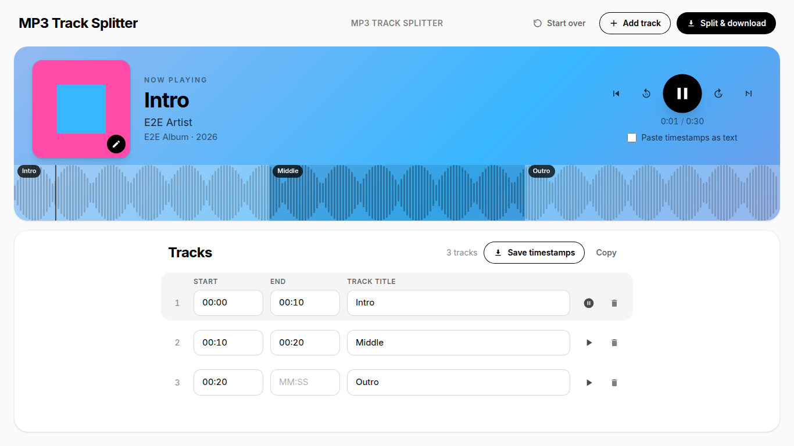
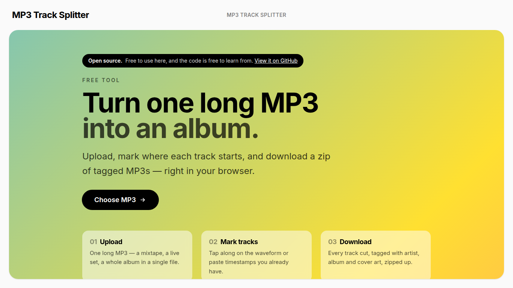
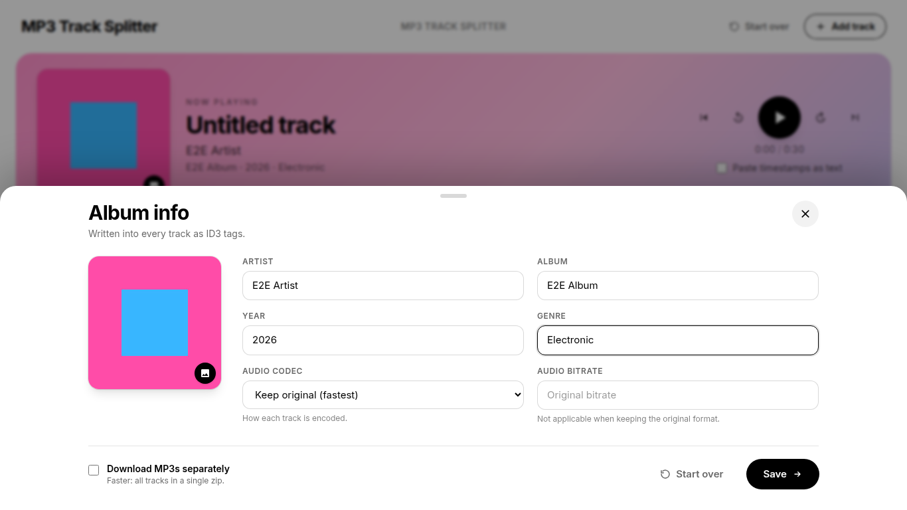
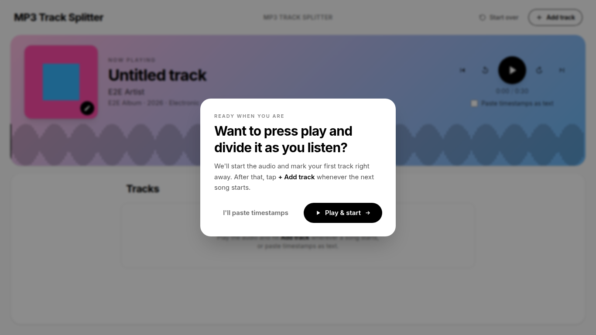
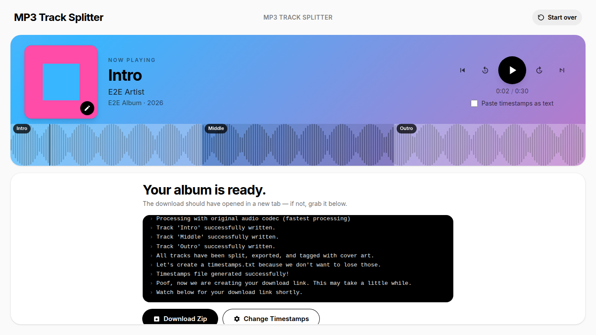
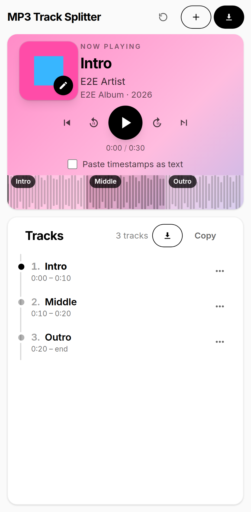

# next-ffmpeg-audio-splitter

**Turn one long MP3 into an album.** Upload a mixtape, a live set or a whole album ripped as a single file, mark
where each track starts, and download a zip of individual tracks, each tagged with artist, album, year, genre and
cover art.

<p align="center">
  
</p>

## Try it

It's free, with no account and no install:
**[candycreative.digital/audio-track-splitter](https://candycreative.digital/audio-track-splitter)**

That's where it lives today. It may move to its own domain later, and this README will point to the new address.

## About this project

This is a personal project by me, [Tyler Clay](https://tylerthedeveloper.com): a simple, free way to split long
recordings into properly tagged tracks. I host it for anyone to use, and I'm sharing the code so others can learn
from it, run their own copy, or build something better on top of it.

It's free to use, and the code is MIT licensed. There are no ads and no catch.

More of my work is at **[tylerthedeveloper.com](https://tylerthedeveloper.com)**.

## What it does

<table>
  <tr>
    <td width="50%"></td>
    <td width="50%"></td>
  </tr>
  <tr>
    <td><b>Drop in one long MP3.</b> It stays in your browser (IndexedDB) until you split, so a reload doesn't lose your work.</td>
    <td><b>Add album info and cover art.</b> They're written into every track as ID3 tags and an attached picture.</td>
  </tr>
  <tr>
    <td></td>
    <td></td>
  </tr>
  <tr>
    <td><b>Mark tracks as you listen,</b> or paste timestamps you already have (<code>0:00 Intro</code>, <code>3:12 Song two</code>…). A short guide walks first-timers through it.</td>
    <td><b>Split and download.</b> ffmpeg cuts every track on the server, streaming progress live, and you get one zip.</td>
  </tr>
</table>



- Waveform editor ([wavesurfer.js](https://wavesurfer.xyz/)): tap **Add track** while it plays, or drag regions
- Paste timestamps as text, and save them back out to a file
- Output as the original MP3 stream (lossless, fastest), re-encoded MP3, AAC (`.m4a`) or Opus
- Live progress over server-sent events while ffmpeg works
- Built for phones too, down to a 375px-wide iPhone SE: layout tested on four screen sizes, with no pinch-zoom or keyboard surprises
- Downloads as one zip, or as individual tracks

<br clear="right">

## How it works

```
browser                                         Next.js server (app/audio-tools/split-track/route.ts)
───────                                         ─────────────────────────────────────────────────────
upload MP3 + cover + timestamps  ── POST ──▶    save to generated/audio-split/<id>
                                                validate cut points against ffprobe's duration
                                                ffmpeg: one cut per track, tags + cover attached
                    ◀── SSE progress ──         zip the tracks + timestamps.txt
                                                store (S3 or local disk), return keys
download zip / single tracks     ── GET ?key ─▶ stream from storage
```

| Path | What lives there |
| --- | --- |
| `app/page.tsx` | The tool, rendered at `/` |
| `app/audio-tools/split-track/` | API route: upload, ffmpeg cutting and tagging, zipping, storage, downloads |
| `src/components/AudioSplitTrack/` | UI: waveform, timestamp editor, album drawer, progress log, guided tour |
| `src/redux/` | Client state, persisted with redux-persist |
| `src/utils/` | S3 client, reCAPTCHA verification, IndexedDB helpers |
| `e2e/` | Playwright specs, fixtures and visual baselines |

Some of the more interesting bits if you're here to learn:

- **Streaming progress without WebSockets.** The split endpoint answers its POST with a `text/event-stream`, so
  the client reads ffmpeg's progress from the same request that uploaded the file.
- **Validating before ffmpeg runs.** Timestamps are checked against the real duration from `ffprobe`, so a
  reversed or out-of-range cut returns an error naming the track instead of crashing ffmpeg.
- **Cover art that survives every codec.** MP3 gets an ID3 attached picture; `.m4a` gets an attached cover stream.
  The e2e suite checks each one with `ffprobe`.
- **Work that survives a reload.** The audio and cover live in IndexedDB; only the durable parts of the tracklist go
  to `localStorage`.

## Running it yourself

Requirements: Node 22+, Yarn 1, and `ffmpeg` / `ffprobe` on your `PATH`
(`brew install ffmpeg`, `apt install ffmpeg`, or `choco install ffmpeg`).

```sh
yarn install
cp .env.example .env.local   # local defaults: disk storage, captcha skipped
yarn dev                     # http://localhost:3000
```

With the defaults in `.env.example` you need no AWS account and no reCAPTCHA keys.

### Configuration

All configuration is environment variables; see [`.env.example`](.env.example) for the full list.

| Variable | Purpose |
| --- | --- |
| `SPLIT_TRACK_STORAGE` | `local` stores results under `./generated`; anything else uses S3 |
| `AWS_BUCKET_NAME`, `AWS_REGION`, `AWS_ACCESS_KEY_ID`, `AWS_SECRET_ACCESS_KEY` | S3 storage |
| `NEXT_PUBLIC_REACT_CAPTCHA_SITE_KEY`, `CAPTCHA_SECRET_KEY` | reCAPTCHA v2 in front of the split endpoint |
| `SKIP_CAPTCHA`, `NEXT_PUBLIC_SKIP_CAPTCHA` | Skip the captcha in development (ignored in production) |
| `NEXT_PUBLIC_SITE_NAME`, `NEXT_PUBLIC_SITE_URL`, `NEXT_PUBLIC_SOURCE_URL` | Branding, canonical URL, and the "view the code" link |

### Docker

```sh
docker build -t audio-splitter \
  --build-arg NEXT_PUBLIC_SITE_NAME="My Splitter" \
  --build-arg NEXT_PUBLIC_REACT_CAPTCHA_SITE_KEY=... .
docker run -p 3000:3000 --env-file .env.production.local audio-splitter
```

The image includes ffmpeg. The tool needs a long-running Node server: splits stream progress for as long as
ffmpeg runs, and uploads can be large, so serverless function limits are a poor fit.

## Tests

```sh
yarn typecheck
yarn test                    # Jest unit tests
npx playwright install chromium
yarn e2e                     # Playwright, 4 viewports: desktop, 13" laptop, Pixel 7, iPhone SE
yarn e2e:ui                  # watch it run
```

The E2E suite starts its own dev server on port 3900 with local storage and the captcha skipped, so it needs
no credentials. The screenshots in this README come from the suite's walkthrough spec
(`yarn e2e audio-splitter.walkthrough` writes them to `e2e/.results/walkthrough/`).
See [`e2e/README.md`](e2e/README.md) for what each spec covers.

## Secrets

Nothing secret is ever committed. `.env*` files are git-ignored (except `.env.example`, which holds names
only), CI runs [gitleaks](https://github.com/gitleaks/gitleaks) over the full history on every push, and
production values come from the host's secret store. To check before you push:

```sh
gitleaks git --redact .
```

Found a security issue? Please reach out through [tylerthedeveloper.com](https://tylerthedeveloper.com) instead of
opening a public issue.

## Contributing

Issues and pull requests are welcome. Please run `yarn typecheck`, `yarn test` and `yarn e2e` before opening a PR.
If you change the layout on purpose, refresh the visual baselines with `yarn e2e:update-snapshots`.

## License

[MIT](LICENSE) © [Tyler Clay](https://tylerthedeveloper.com)
